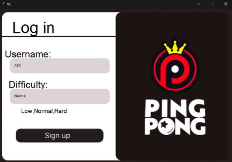

# PyPong - Immersive Ping Pong Game  

## Overview

Welcome to PyPong, an immersive ping-pong game crafted with Python and Turtle graphics. Experience the thrill of this classic game in a simple yet engaging environment. Whether you're a seasoned player or new to the game, PyPong offers endless fun and excitement.

## Features

- **Intuitive Controls:** Navigate the paddle easily using simple keyboard controls.
- **Dynamic Gameplay:** Experience dynamic ball movement and realistic collisions for an immersive gaming experience.
- **Score Tracking:** Keep track of your high scores and challenge yourself to beat your personal best.
- **Interactive Graphics:** Enjoy visually appealing graphics and smooth animations powered by Turtle graphics.

## How to Play

- Control the paddle by using the `W` and `S` keys (Player 1).
- For two-player mode, use the `Up` and `Down` arrow keys to control the second paddle (Player 2).

## Screenshots

## Feedback and Contributions

We welcome your feedback and contributions! If you encounter any issues or have suggestions for improvement, please open an issue. Please feel free to fix the repository and submit a pull request.

Dive into the immersive world of PyPong and rediscover the joy of classic ping pong in this Python and Turtle graphics creation. Challenge your reflexes, set high scores, and enjoy hours of entertainment. Happy gaming! 🎮🏓
